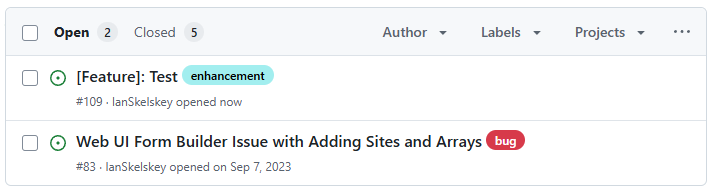

import Admonition from '@theme/Admonition';
import GitHubLogo from '@site/static/img/github/github-mark.png';

## Introduction

Welcome to the Field Day feedback and issue reporting guide. This document will help you understand how to report issues, request features, and provide feedback for the Field Day project.

## What is GitHub?

GitHub is a tool for software developers, but you don't need to be a developer to use it. It's a user-friendly platform that allows you to report issues, request features, and provide feedback on the Field Day project.

GitHub is a platform for version control and collaboration. It allows multiple people to work on projects simultaneously, track changes, and manage different versions of the project. To report issues or request features for Field Day, you will need a GitHub account. Don't worry, it's free and easy to sign up.

## How to Sign Up for GitHub

1. Visit the GitHub website: [https://github.com/join](https://github.com/join)
2. Fill in the required information to create your account.
3. Verify your email address by clicking the link sent to your email.
4. Complete the setup process by following the on-screen instructions.

## Browsing Existing Issues

If you're already in a repository on GitHub, you can access the issues tab by clicking on the "Issues" tab at the top of the repository page.

Browsing existing issues is a good way to get a feel for the state of the project and see if your issue or feature request has already been reported. Here's how you can browse existing issues:

1. Visit the appropriate repository for your issue:
   - [Field Day Documentation Issues](https://github.com/Field-Day-2022/field-day-2022.github.io/issues)
   - [Desktop Data Manager Issues](https://github.com/Field-Day-2022/desktop-data-manager/issues)
   - [Mobile Data Collector Issues](https://github.com/Field-Day-2022/mobile-data-collector/issues)

2. Use the search bar at the top of the issues page to search for keywords related to your issue or feature request.

3. Browse through the list of issues to see if your issue has already been reported. If you find a similar issue, you can add your comments or additional information to that issue instead of creating a new one.

## Reporting Issues and Requesting Features

To report issues or request features, you will need to create a new issue on GitHub. Follow these steps:

1. Visit the appropriate repository for your issue:
   - [Create a new issue for Field Day Documentation](https://github.com/Field-Day-2022/field-day-2022.github.io/issues/new/choose)
   - [Create a new issue for Desktop Data Manager](https://github.com/Field-Day-2022/desktop-data-manager/issues/new/choose)
   - [Create a new issue for Mobile Data Collector](https://github.com/Field-Day-2022/mobile-data-collector/issues/new/choose)

<Admonition type="important" title="Important">
Before creating a new issue, it's important to check if the issue has already been reported. This helps avoid duplicates and ensures that all feedback is consolidated. See the above section on [browsing existing issues](#browsing-existing-issues).
</Admonition>

2. Choose an appropriate template for your issue:

The following tables contain the available issue templates for documentation and application-related issues.

### Issue Template Types for Documentation

| Template Type             | Description                                                                 |
|---------------------------|-----------------------------------------------------------------------------|
| New Documentation Request | Use this template to request new documentation for features or processes that are not yet documented. |
| Documentation Feedback    | Use this template to provide feedback on existing documentation, including suggestions for improvements or corrections. |
| General Issue             | Use this template for any other documentation-related issues that do not fit into the other categories. |
| Blank Issue               | Use this template if none of the other documentation templates fit your needs. This template allows you to describe your issue in detail. |

### Issue Template Types for Application

| Template Type      | Description                                                                 |
|--------------------|-----------------------------------------------------------------------------|
| Bug Report         | Use this template to report bugs or issues you encounter while using the application. |
| Feature Request    | Use this template to request new features or enhancements for the application. |
| Enhancement Request| Use this template to suggest improvements or enhancements to existing features in the application. |

3. Fill in the required information in the template and submit your issue. Required fields are marked with a red asterisk (*).

4. Press the "Create" button to submit your issue.

5. You're done! You should have been redirected to the issue you created. You can now track the progress of your issue and provide additional information if needed. 🎉

