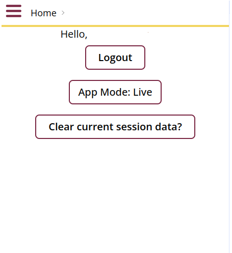
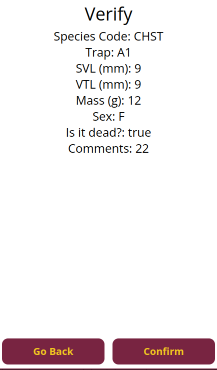

## Introduction

The Field Day project is a Wildlife Data Collection and management tool designed to address field researchers' challenges, particularly those in biology and ecology. The project consists of:

* A Progressive Web App (PWA) for mobile devices
* A web application for larger screens

:::tip Key features include:
* Streamlined data collection
* Offline functionality with local database caching
* 2-factor Google authentication
* Population data collection using capture mark-recapture techniques
* Data management, viewing, and export capabilities
:::

## Getting Started

### Initial Setup and Login

1. Access the PWA at [https://asu-field-day-pwa.web.app/](https://asu-field-day-pwa.web.app/) on your mobile device.
2. Enter your handler initials (2-3 characters required).
3. Select your project, site, and array from the dropdown menus.

## Using the Search Function

When selecting *Search* from the menu, you can:

1. Use the dropdown filters to narrow your search:
   * Project
   * Site
   * Array
2. Enter search terms in the *Search Database* field:
   * Use `+` between terms to search for multiple items.
   * Example: `ASTI+A1B2` will find entries containing both "ASTI" and "A1B2".
3. Click the *Search* button to find matching records.

:::tip
The search will return any records that contain all the terms you entered, regardless of their order or location in the record.
:::

## Data Collection Process

### Recording New Data

1. Enter Recorder Initials.
2. Enter Handler Initials.
3. Select Project, Site, and Array.
4. Selecting *No* will close the session.
5. Selecting *Yes* will take you to the next screen.

:::tip
To add new entries, select the form, select taxa, and add counts. Once complete, choose *End Session*.
:::

:::caution
Errors on the verification screen should be resolved by using the back button to make corrections.
:::

### Species Entry Form

:::tip
* Comments and "Is it dead?" are optional. All other fields are required.
* Sex can be male, female, or unknown.
* If you are unable to proceed, check that all required fields are filled out.
:::

## Data Entry Guidelines

### Fields for Entry:

* Species Code
* Fence Trap location
* Mass (g)
* Sex
* "Is it dead?" status (optional)
* Comments (optional)

:::important
Always verify your entries in the confirmation screen before submitting data. Once submitted, modifications must be made through the History page.
:::

## Session Management

1. Select *End Session* when finished with data collection.
2. Review the number of critters recorded.
3. Confirm your intention to close the session.
:::note
Closed sessions can be accessed later through the History page to edit or add data.
:::

## Best Practices

* Always double-check measurements before submission.
* Use the comments field to note any unusual observations.
* Ensure all required fields are completed.
* Verify your data in the confirmation screen.

:::important
Once a session is ended and confirmed, you'll need to access the History page to make any additional entries or modifications.
:::